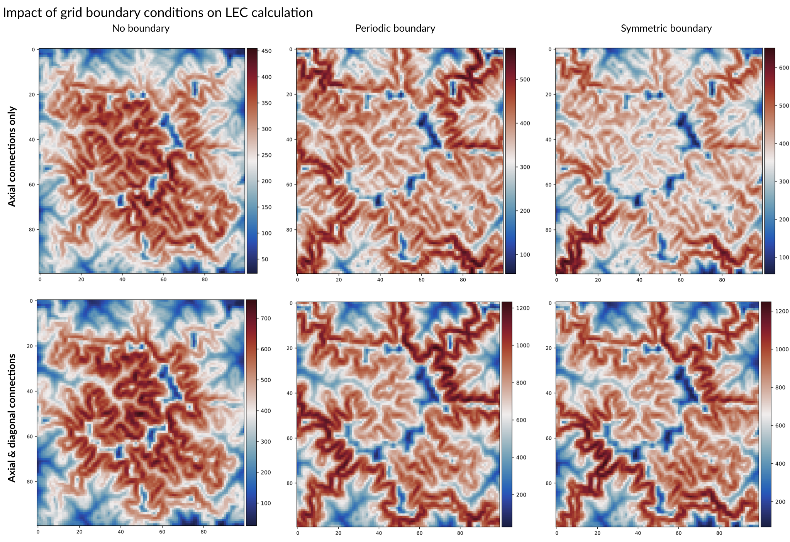

.. bioLEC documentation master file, created by
   sphinx-quickstart on Fri May 10 16:22:41 2019.
   You can adapt this file completely to your liking, but it should at least
   contain the root `toctree` directive.

bioLEC - *Landscape elevational connectivity*
=============================================

Overview
========

**bioLEC** is a parallel python package built to calculate the *Landscape elevational connectivity* (**LEC**).
**LEC** quantifies the closeness of a site to all others with similar elevation.

For a given landscape, LEC is primarily dependent on the elevation field and on species niche width.
It quantifies the closeness of any point in the landscape to all others at similar elevation.

Contents
========

.. toctree::
   installation
   usage
   bioLEC
   :maxdepth: 3

License
**********************

This program is free software: you can redistribute it and/or modify it under the terms of the **GNU Lesser General Public License** as published by the **Free Software Foundation**, either version 3 of the License, or (at your option) any later version.

.. seealso::
  This program is distributed in the hope that it will be useful, but WITHOUT ANY WARRANTY; without even the implied warranty of MERCHANTABILITY or FITNESS FOR A PARTICULAR PURPOSE.  See the GNU Lesser General Public License for more details.
  You should have received a copy of the GNU Lesser General Public License along with this program.  If not, see http://www.gnu.org/licenses/lgpl-3.0.en.html.

Community driven
**********************

We welcome all kinds of contributions! Please get in touch if you would like to help out.
Everything from code to notebooks to examples and documentation are all equally valuable so please don't feel you can't contribute.

To contribute please fork the project make your changes and submit a pull request. We will do our best to work through any issues with you and get your code merged into the main branch.

.. seealso::
  If you found a bug, have questions, or are just having trouble with **bioLEC**, you can:
  * join the **bioLEC User Group on Slack** by sending an email request to: tristan.salles@sydney.edu.au
  * open an issue in our issue-tracker_ and we'll try to help resolve the concern.

.. _issue-tracker: https://github.com/Geodels/bioLEC/issues/new)

Indices and tables
==================

* :ref:`genindex`
* :ref:`modindex`
* :ref:`search`
