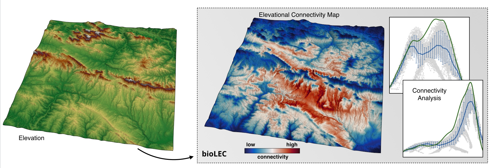

.. bioLEC documentation master file, created by
   sphinx-quickstart on Fri May 10 16:22:41 2019.
   You can adapt this file completely to your liking, but it should at least
   contain the root `toctree` directive.

bioLEC - *Landscape elevational connectivity*
=============================================

.. image:: https://readthedocs.org/projects/biolec/badge/?version=latest
  :target: https://biolec.readthedocs.io/en/latest/?badge=latest
  :alt: Documentation Status

Understanding how biodiversity formed and evolved is a key challenge in evolutionary and ecological biology [Newbold2016]_. Despite a theoretical consensus on how best to measure biodiversity from a biological perspective (_i.e._ number of species, length of all branches on the tree of life of a species, and differences in allele and genotype frequencies within species) standardised and cost-effective methods for assessing it on a broad range of scales are lacking [Chiarucci2011]_. Estimates of some of theses landscape abiotic properties are already available through standard software such as ArcGIS or QGIS and in more specific mountainous landscape focussed packages such as LSD Topo Tools or pyBadlands.

In 2016, a new metric called the Landscape Elevational Connectivity (LEC) was proposed to estimate biodiversity in mountainous landscape [@Bertuzzo:2016]. It efficiently measures the landscape resistance to migration and is able to account for up to 70% of biodiversity predicted by meta-community models [Bertuzzo2016]_.

**bioLEC** is a Python package designed to quickly calculate for any mountainous landscape surface and species niche width its associated LEC index. From an elevational fitness perspective, all migratory paths on a flat landscape are equal. This is not the case on a complex landscape where migration can only occur along a network of corridors providing species with their elevational requirements. Hence, predicting how species will disperse across a landscape requires a model of migration that takes into account the physical properties of the landscape, the species fitness range, as well as evolving environmental conditions.

.. note::
  **LEC** quantifies the closeness of a site to all others with **similar elevation**. It measures how easily a **species living in a given patch can spread and colonise other patches**. It is assumed to be **elevation-dependent** and the metric depends on how often a species adapted to a given elevation *needs to travel outside its optimal elevation range* when moving from its patch to any other in the landscape. **bioLEC** package can be used in serial or parallel to evaluate biodiversity patterns of a given landscape. It is an efficient and easy-to-use tool to quickly assess the capacity of landscape to support biodiversity and to predict species dispersal across mountainous landscapes.

Contents
--------

.. toctree::
   method
   installation
   usage
   social
   bioLEC
   :maxdepth: 3

Indices and tables
------------------

* :ref:`genindex`
* :ref:`modindex`
* :ref:`search`

.. [Newbold2016] T. Newbold, et al. -
	Has land use pushed terrestrial biodiversity beyond the planetary boundary? A global assessment. Science, 353(6296) 288-291, `DOI: 10.1126/science.aaf2201`_, 2016.

.. [Chiarucci2011] A. Chiarucci, G. Bacaro, & S. Scheiner -
    Old and new challenges in using species diversity for assessing biodiversity. Phil. Trans. R. Soc. B  Biol Sci., 366(1576) 2426-2437, `DOI: 10.1098/rstb.2011.0065`_,2011.

.. [Bertuzzo2016] E. Bertuzzo, F. Carrara, L. Mari, F. Altermatt, I. Rodriguez-Iturbe & A. Rinaldo -
  Geomorphic controls on species richness. PNAS, 113(7) 1737-1742, `DOI: 10.1073/pnas.1518922113`_, 2016.

.. [Dijkstra1959] E.W. Dijkstra -
  A note on two problems in connexion with graphs. Numer. Math. 1, 269-271, `DOI: 10.1007/BF01386390`_, 1959.

.. [Etherington2016] T.R. Etherington -
  Least-cost modelling and landscape ecology: concepts, applications, and opportunities. Current Landscape Ecology Reports 1:40-53, `DOI: 10.1007/s40823-016-0006-9`_, 2016.

.. [Etherington2017] T.R. Etherington -
  Least-cost modelling with Python using scikit-image, Blog_, 2017.

.. [Lomolino2008] M.V. Lomolino -
  Elevation gradients of species-density: historical and prospective views. Glob. Ecol. Biogeogr. 10, 3-13, `DOI: 10.1046/j.1466-822x.2001.00229.x`_, 2008.

.. [vanderWalt2014] S. van der Walt, J.L. Schönberger, J. Nunez-Iglesias, F. Boulogne, J.D. Warner, N. Yager, E. Gouillart & T. Yu -
  Scikit Image Contributors - scikit-image: image processing in Python, `PeerJ 2:e453`_, 2014.
