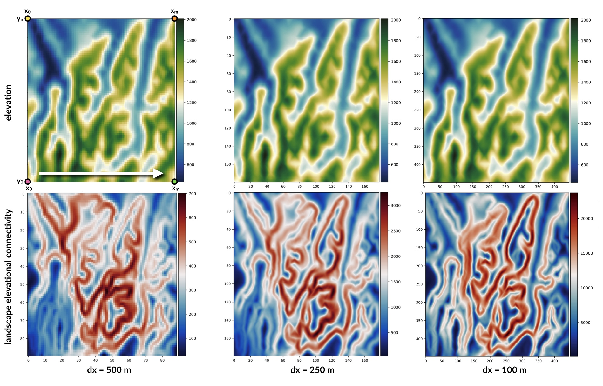
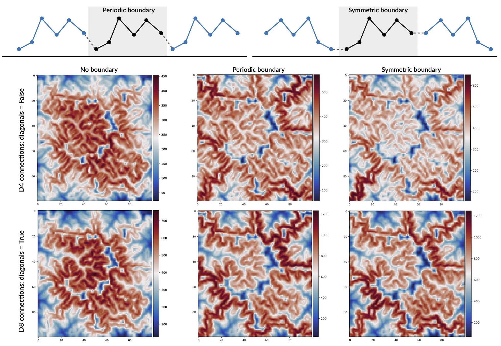
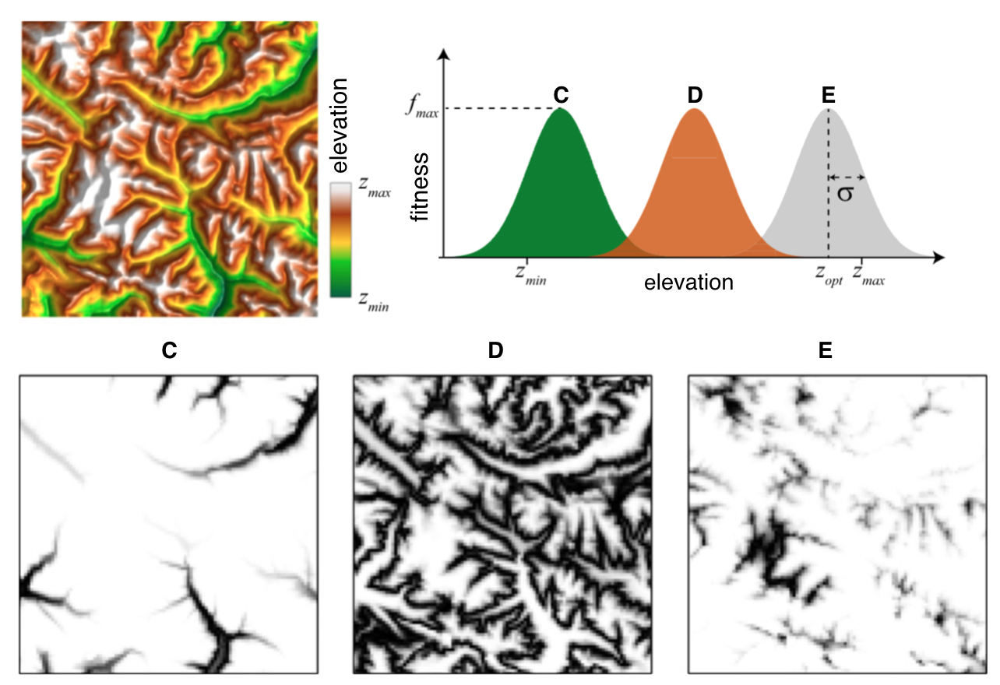
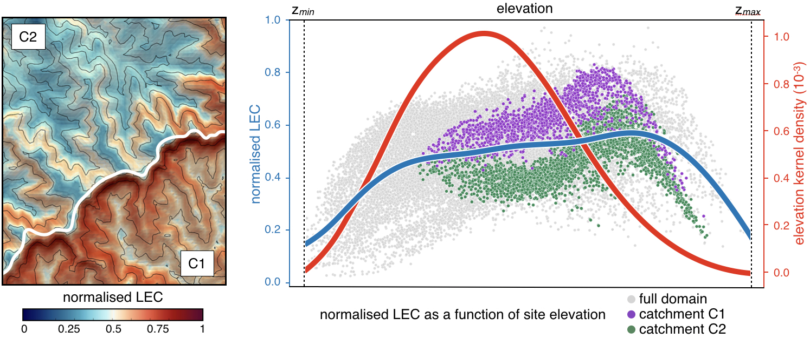

Quick start guide
=================

I/O Options
-----------

The most simple code lines to use **bioLEC** package is summarised below

.. code-block:: python
  :emphasize-lines: 3,4

  import bioLEC as bLEC

  biodiv = bLEC.landscapeConnectivity(filename='pathtofile.csv')
  biodiv.computeLEC()

  biodiv.writeLEC('result')
  biodiv.viewResult(imName='plot.png')

Input
*****

The entry point is the function :code:`landscapeConnectivity()` that requires the **elevation** field as it main input.
There are 3 ways to import the elevation dataset :

* as a :code:`CSV` file (argument: :code:`filename`) containing 3 columns for X, Y and Z respectively with no header and ordered along the X axis first (as illustrated in the top figure) and shown below:

  .. math::
    \begin{smallmatrix}
     x_0 & y_0 & z_{0,0} \\
     x_1 & y_0 & z_{1,0} \\
     \vdots & \vdots & \vdots \\
     x_m & y_0 & z_{m,0} \\
     x_0 & y_1 & z_{0,1} \\
     \vdots & \vdots & \vdots \\
     x_m & y_n & z_{m,n} \\
     \end{smallmatrix}

* as a 3D numpy array (argument: :code:`XYZ`) containing the X, Y and Z coordinates here again ordered along the X axis first (as above)
* or as a 2D numpy array (argument: :code:`Z`) containing the elevation matrix (example provided below), in this case the :code:`dx` argument is also required

  .. math::
    \begin{smallmatrix}
     z_{0,0} & z_{1,0} & \cdots & z_{m-1,0} & z_{m,0} \\
     \vdots & \vdots & \vdots & \vdots & \vdots \\
     z_{0,k} & z_{1,k} & \cdots & z_{m-1,k} & z_{m,k} \\
     \vdots & \vdots & \vdots & \vdots & \vdots \\
     z_{0,n} & z_{1,n} & \cdots & z_{m-1,n} & z_{m,n} \\
     \end{smallmatrix}

In addition to the elevation field, the user could specify the **boundary conditions** used to compute the LEC. Two options are available: :code:`periodic` or :code:`symmetric` boundaries. The way these two boundaries are implemented in **bioLEC** is illustrated in the figure below as well as the impact on the LEC calculation.

Finally the LEC solution requires the declaration of the **species niche width** defined by the variable :code:`sigma` in the following equation (look in the `What is LEC? section <https://biolec.readthedocs.io/en/latest/method.html>`_ for more information):

.. math::
   -\ln C_{ji} = \frac{1}{2\sigma^2} \min_{p  \in \{j\rightarrow i\}} \sum_{r=2}^L (z_{k_r}-z_j)^2

The above figure from [Bertuzzo16]_ shows the habitat maps as a function of elevation for a real fluvial landscape when considering the fitness of three different species as a function of elevation. The fitness maps of the three species are shown on the bottom panels. In **bioLEC** two options are possible:

* either the user specifies a species niche width percentage based on elevation extent with the parameter :code:`sigmap`
* or a species niche fixed width values with the declaration of the parameter :code:`sigmav`

Outputs
*******

.. code-block:: python
  :emphasize-lines: 6,7

  import bioLEC as bLEC

  biodiv = bLEC.landscapeConnectivity(filename='pathtofile.csv')
  biodiv.computeLEC()

  biodiv.writeLEC('result')
  biodiv.viewResult(imName='plot.png')

Once the :code:`computeLEC()` function has been ran, the result are then available in different forms.

From the :code:`writeLEC` function, the user can first save the dataset in :code:`CSV` and :code:`VTK` formats containing the X,Y,Z coordinates as well as the computed LEC and normalised LEC (_nLEC_).

Then several figures can be created showing **maps of elevation and LEC values** as well as graphs of LEC and elevation frequency as a function of site elevation (such as the figure presented below). In some functions, one can plot the average and error bars of LEC within elevational bands.

Available plotting functions are provided below:

* :code:`viewResult`
* :code:`viewElevFrequency`
* :code:`viewLECFrequency`
* :code:`viewLECZbar`
* :code:`viewLECZFrequency`

For a complete list of available options, users need to go to the `API documentation <https://biolec.readthedocs.io/en/latest/bioLEC.html#bioLEC.LEC.landscapeConnectivity.viewLECFrequency>`_.

Running examples
----------------

Binder
******

.. image:: https://mybinder.org/badge_logo.svg
  :target: https://mybinder.org/v2/gh/Geodels/bioLEC/binder?filepath=Notebooks

Notebooks
*********

An example is provided...

HPC
***

The tool can be used to compute the **LEC** for any landscape file as long as the data is available from a **CSV file containing 3D coordinates (X,Y,Z)**.

.. attention::
  Notebooks environment will not be the best option for **large landscape models** and we will recommend the use of the python script: ``runLEC.py`` in **HPC environment**.

In this case, the code will need to be

.. code-block:: bash

  $ mpirun -np XX python runLEC.py

with XX represents the number of processor to use.

The python script ``runLEC.py`` is defined by:

.. code-block:: python

  import argparse
  from bioLEC import LEC

  # Parsing command line arguments
  parser = argparse.ArgumentParser(description='This is a simple entry to run bioLEC package from python.',add_help=True)

  # Required
  parser.add_argument('-i','--input', help='Input file name (csv file)',required=True)
  parser.add_argument('-o','--output',help='Output file name without extension', required=True)

  # Optional
  parser.add_argument('-p','--periodic',help='True/false option for periodic boundary conditions', required=False, action="store_true", default=False)
  parser.add_argument('-s','--symmetric',help='True/false option for symmetric boundary conditions', required=False, action="store_true", default=False)
  parser.add_argument('-w','--width',help='Float option for species niche width percentage', required=False, action="store_true", default=0.1)
  parser.add_argument('-f','--fix',help='Float option for species niche width fix values', required=False, action="store_true", default=None)
  parser.add_argument('-c','--connected',help='True/false option for computing the path based on the diagonal moves as well as the axial ones', required=False, action="store_true", default=True)
  parser.add_argument('-t','--top',help='Header lines in the elevation grid', required=False, action="store_true", default=0)
  parser.add_argument('-n','--nout',help='Number for output frequency during run', required=False, action="store_true", default=500)
  parser.add_argument('-d','--delimiter',help='String for elevation grid csv delimiter', required=False,action="store_true",default=',')
  parser.add_argument('-v','--verbose',help='True/false option for verbose', required=False,action="store_true",default=False)

  args = parser.parse_args()
  if args.verbose:
    print("Required arguments: ")
    print("   + Input file: {}".format(args.input))
    print("   + Output file without extension: {}".format(args.output))
    print("\nOptional arguments: ")
    print("   + Periodic boundary conditions for the elevation grid: {}".format(args.periodic))
    print("   + Symmetric boundary conditions for the elevation grid: {}".format(args.symmetric))
    print("   + Species niche width percentage based on elevation extent: {}".format(args.width))
    print("   + Species niche width based on elevation extent: {}".format(args.fix))
    print("   + Computes the path based on the diagonal moves as well as the axial ones: {}".format(args.connected))
    print("   + Elevation grid csv delimiter: {}".format(args.delimiter))
    print("   + Number of header lines: {}".format(args.top))
    print("   + Number for output frequency: {}\n".format(args.nout))

  biodiv = LEC.landscapeConnectivity(filename=args.input,periodic=args.periodic,symmetric=args.symmetric,
                                      sigmap=args.width,sigmav=args.fix,connected=args.connected,
                                      delimiter=args.delimiter,header=args.top)

  biodiv.computeLEC(args.nout)

  biodiv.writeLEC(args.output)
  if biodiv.rank == 0:
      biodiv.viewResult(imName=args.output+'.png')
      biodiv.viewElevFrequency(input=args.output+'.csv',imName=args.output+'_zfreq.png')
      biodiv.viewLECZFrequency(input=args.output+'.csv',imName=args.output+'_leczfreq.png')
      biodiv.viewLECFrequency(input=args.output+'.csv',imName=args.output+'_lecfreq.png')
      biodiv.viewLECZbar(input=args.output+'.csv',imName=args.output+'_lecbar.png')

.. [Bertuzzo16] E. Bertuzzo, F. Carrara, L. Mari, F. Altermatt, I. Rodriguez-Iturbe & A. Rinaldo -
  Geomorphic controls on species richness. PNAS, 113(7) 1737-1742, `DOI: 10.1073/pnas.1518922113`_, 2016.

.. _`DOI: 10.1073/pnas.1518922113`: http://www.pnas.org/cgi/doi/10.1073/pnas.1518922113
